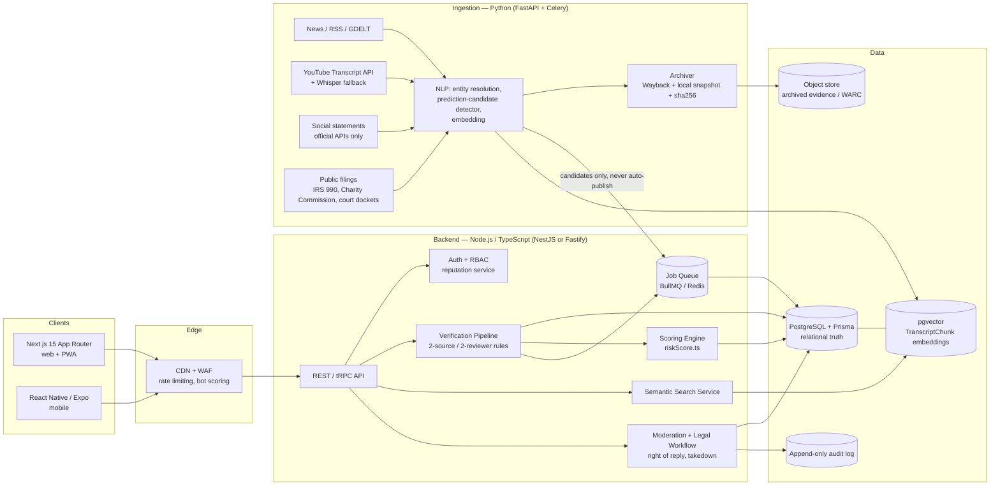
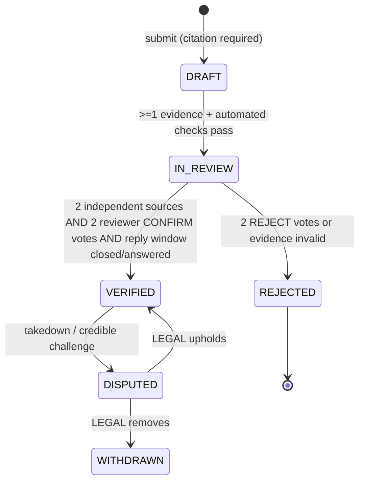

# Proeven False Prophets App (PFPA) — Product & Architecture Blueprint

Version 1.0 · Companion files: [`prisma/schema.prisma`](../prisma/schema.prisma), [`src/scoring/riskScore.ts`](../src/scoring/riskScore.ts)

---

## 1. Executive Summary

**What PFPA is.** An evidence-first aggregation platform that lets people examine public religious/spiritual leaders against *observable, citable* criteria: did time-bound predictions come true, are finances transparent, are there documented harms, and does the leader's organization show recognised high-control patterns (BITE model).

**What PFPA is not.** It does not judge whether a faith, doctrine, or miracle claim is *true*. Theology is out of scope; **conduct, falsifiable claims, money, and coercion are in scope.** The product never outputs the verdict "false prophet" — only a transparent **Risk Indicator Score** with its evidence and confidence.

**Why the design looks the way it does.** A site that publicly scores named people carries the highest defamation and brigading risk of any content platform. The architecture therefore makes safety structural, not cosmetic:

| Principle | How it is enforced |
|---|---|
| No evidence, no publication | DB-level rule: every Claim/Incident/Review needs ≥1 Evidence row to leave `DRAFT`; ≥2 *independent* sources + 2 reviewer confirmations to reach `VERIFIED` |
| Only verified data is scored | Scoring engine ignores anything not `VERIFIED` |
| Missing data ≠ guilt | Empty dimensions are excluded; low confidence shows "Insufficient data" |
| Allegation ≠ finding | Separate UI wording; `isAllegationOnly` vs `officialFinding` |
| Fairness to subject | Right of Reply window, Statement of Record, dispute banner, takedown workflow |
| Anti-brigading | Reputation-weighted reviewers, rate limits, burst detection, conflict declarations |
| Reproducible | Published methodology, versioned weights, immutable `ScoreSnapshot` history |

### 1.1 Architecture diagram



**Key decision: ingestion produces *candidates*, never published facts.** Machine-detected predictions and scandals enter a human review queue. This keeps the legal posture ("aggregator of verified, cited reports") defensible.

### 1.2 Stack recommendation

| Layer | Choice | Rationale |
|---|---|---|
| Web | **Next.js (App Router)** + Tailwind + shadcn/ui | SSR/ISR for SEO on leader pages; server components keep evidence rendering fast |
| Mobile | **React Native (Expo)** sharing a TS SDK/types with web | One language end to end; Flutter is a fine alternative if no TS sharing is wanted |
| API | Node.js + TypeScript, tRPC/REST, Zod validation | Types flow from Prisma → API → UI |
| DB | **PostgreSQL + Prisma** | Strong constraints/triggers for the verification rules |
| Vector | **pgvector** (start) → Pinecone only if >50M chunks | One transactional store; join vectors with relational filters |
| Ingestion | **Python** (FastAPI, Celery, `youtube-transcript-api`, `trafilatura`, spaCy, sentence-transformers) | Best NLP/scraping ecosystem |
| Queue/cache | Redis + BullMQ / Celery | Decouple ingestion and scoring recomputation |
| Infra | Docker, Postgres managed (RDS/Neon), S3, Cloudflare | |

Ingestion rules: respect `robots.txt`/ToS, use official APIs, store excerpts + links (not full copyrighted articles), always archive a snapshot with SHA-256 so evidence survives link rot.

---

## 2. Product Requirements (condensed PRD)

**Personas:** (1) *Seeker/family member* — checking a leader before donating or joining; (2) *Researcher/journalist* — tracing claims; (3) *Former member/witness* — contributing documented accounts; (4) *Reviewer/editor* — verifying; (5) *Leader/representative* — right of reply.

**MVP scope (P0):** leader profiles; claim tracker with outcomes; incident log; evidence attachments + archiving; verification queue; score with breakdown; right of reply; takedown form; semantic search over transcripts.
**P1:** BITE guided assessment; financial audit checklist; alerts when a target date passes; mobile app; public API for researchers.
**P2:** multilingual; claim-similarity clustering ("same prophecy, new date"); embeddable widgets.

**Success metrics:** % of published items with ≥2 independent sources (target 100%); median time-to-verify; takedown-upheld rate (quality signal); share of leaders with reply offered; false-positive reversals; reviewer inter-rater agreement (Cohen's κ ≥ 0.7 on severity).

---

## 3. Data Model

See [`prisma/schema.prisma`](../prisma/schema.prisma). Highlights:

* **Leader / Organization / Affiliation** — profile + status; `tradition` is descriptive only and is *never* a scoring input.
* **Claim** — verbatim `statementText`, `dateMade`, `targetDate`, `sourceUrl` (+ `sourceTimestamp`), `outcome ∈ {PENDING, FULFILLED, FAILED, RETRACTED, MODIFIED}`, `specificity` (0–1), `ClaimVersion` history to prove silent rewording.
* **Incident (red flag)** — category, dimension, severity 1–5, `officialFinding` vs `isAllegationOnly`.
* **Evidence** — polymorphic attachment with `tier` (PRIMARY / TIER1_MEDIA / SECONDARY / SOCIAL), `publisherKey` and `ownershipGroup` (so two syndicated copies of one wire story are *not* "two sources"), `archiveUrl`, `sha256`.
* **VerificationVote**, **Review** (+ **BiteItem**), **RightOfReply**, **Takedown**, **AbuseReport**, **ModerationAction**, **ScoreSnapshot** (immutable history), **Transcript/TranscriptChunk** (pgvector `vector(1536)`).

---

## 4. Ethical, Legal & Abuse-Prevention Framework

> This section is product policy, not legal advice. Have counsel in each launch jurisdiction review it before going live (defamation law differs sharply: truth is a full defence in the US/UK but burden of proof differs; EU/UK GDPR applies to personal data; Section 230 protection does not extend to content PFPA itself writes or edits).

### 4.1 Preventing libel / defamation

1. **Facts, not characterisations.** Free-text fields reject/flag labels such as "fraud", "liar", "cult leader", "false prophet" unless attached to an `officialFinding`. Templates force *who / what / when / documented by*.
2. **Allegation vs. finding.** UI badges: "Alleged — reported by X", "Established — court/regulator finding". Never present allegations in the first-person voice of PFPA.
3. **Quote verbatim, link context.** Claims store the exact words with timestamp and a surrounding-context excerpt to prevent cherry-picking.
4. **Right of reply (mandatory for severity ≥ 3 and all incidents).** Notice sent to `replyContact`; 14-day window; response published adjacent to the item. Lack of response is displayed neutrally ("no response received") and never affects the score.
5. **Statement of Record.** Verified representatives may post a standing statement on the profile.
6. **Takedown & dispute path.** Public form; contested items flip to `DISPUTED` (banner, excluded from score) within 24h while `LEGAL` reviews; decisions logged.
7. **Private individuals & sensitive data.** Only public figures acting in public capacity. No addresses, minors, family, health, or unverified victim identities. Victim testimony may be shown anonymised only after reviewer verification.
8. **Corrections policy.** Public changelog; corrected items re-trigger score recompute and notify the subject.
9. **Insurance & jurisdiction.** Media-liability insurance; incorporate where anti-SLAPP protections exist; geo-handling for jurisdictions with strict defamation law.

### 4.2 Verification pipeline



**"Double-source" definition (enforced in code):** two Evidence rows whose `publisherKey` **and** `ownershipGroup` differ, at least one tier ≤ TIER1_MEDIA (PRIMARY preferred); `SOCIAL`/`SCREENSHOT` never count alone; wire-copy duplicates collapse to one source. **Failed predictions** additionally require: (a) the original statement archived with its date, (b) an unambiguous target date that has passed, (c) a reviewer check that the claim's specificity ≥ 0.6 and that no reasonable alternative reading fulfils it, and (d) a check for any public retraction/modification.

**Reviewer rules:** reviewers cannot verify their own submissions; must declare conflicts; votes weighted by reputation; disagreement escalates to an `EDITOR`.

### 4.3 Anti-brigading / abuse controls

* New accounts: read-only for 7 days; contributions need approval until reputation ≥ threshold.
* Rate limits per user/IP/ASN; burst detector flags many accounts targeting one leader within a short window → submissions auto-hold; the score is *frozen* on the last verified state.
* Because only verified evidence is scored, volume of reports/reviews never moves the score (votes ≠ evidence).
* Reputation rises when contributions survive review, falls on rejections; coordinated-behaviour clustering (shared device/IP patterns, text similarity) → suspension.
* Community reviews display as *experiences*, clearly separated from the score unless converted into verified Incidents.
* Symmetry check: a review must cite evidence even for favourable reviews, so astroturfing in either direction is blocked.
* Audit log of all moderation actions; periodic transparency report.

### 4.4 Terms of Service & Disclaimer framework (outline)

1. **Purpose.** PFPA aggregates publicly available, cited information so readers can form their own judgments. It does not adjudicate religious truth, doctrine, or the sincerity of belief, and opposes harassment of any person or community on the basis of religion.
2. **Not advice / not a verdict.** Scores are algorithmic summaries of verified, cited indicators with stated confidence; they are not statements of fact about a person's character, guilt, or spiritual standing.
3. **User content.** Users warrant good faith, accuracy, and the right to submit; must attach evidence; grant a licence; agree not to submit private data, threats, or harassment; false/malicious submissions → suspension.
4. **Prohibited use.** Doxxing, stalking, coordinated harassment, violence advocacy, use of the data to target believers or congregants.
5. **Subject rights.** Right of reply, dispute/takedown process, corrections, GDPR rights (access/rectification/erasure where applicable).
6. **Limitation of liability, indemnity, governing law** (counsel-drafted); DMCA/notice-and-action process.
7. **Safeguarding notice.** Resources for people leaving high-control groups, abuse reporting hotlines; PFPA does not provide legal or counselling services.
8. **On-page disclaimer (every leader page):** *"Information shown is aggregated from cited public sources and reviewed under our published methodology. Allegations are not findings of fact. This page is not a judgment on any faith or tradition. View sources · Read the response · Dispute an item."*

---

## 5. Evaluation Logic

Implemented in [`src/scoring/riskScore.ts`](../src/scoring/riskScore.ts) (`calculateRiskScore`). The score is a **Risk Indicator Score 0–100 (higher = more risk indicators)**; `Authenticity = 100 − Risk` is a display convenience.

### 5.1 Dimensions & weights (v1.0.0, versioned & public)

| Dimension | Weight | Input | Method |
|---|---|---|---|
| Prediction Fulfillment | 25% | Verified, specific (≥0.6), resolved claims | Specificity-weighted failure rate with Beta(1,1) smoothing; `MODIFIED` counts 0.7 of a miss, `RETRACTED` 0.35; `PENDING` ignored |
| Financial Transparency | 20% | Verified financial incidents + public audit flag | Noisy-OR over severity × recency; no public audit = capped uplift; public audit recorded as credit |
| Behavioral & Moral Integrity | 20% | Verified incidents | Same aggregation |
| Textual & Doctrinal Alignment | 15% | Incidents of **abusive or self-serving deviation from the leader's *own* stated texts/ethical standards** (e.g. text commands care; leader demands the opposite) | Same aggregation; *never* penalises holding a minority theology |
| Cultic / High-Control (BITE) | 20% | Reviewer-rated BITE indicators, 0–3 each | 0.6·mean + 0.4·peak per category; breadth bonus when all four categories are elevated |

### 5.2 Safeguards inside the math

* **Verified-only**, ≥2 independent sources for incidents.
* **Missing ≠ clean:** dimensions with no data are dropped and weights renormalised.
* **Confidence:** each dimension has a saturating confidence by evidence count; effective weight = base × (0.4 + 0.6·confidence). Overall confidence < 0.25 or < 2 dimensions with data → **"Insufficient data"** (no number shown).
* **Recency:** 7-year half-life with a 0.35 floor (old harms fade but don't vanish).
* **Severe override:** one official, high-confidence ≥85 dimension keeps the aggregate ≥ 0.8× that peak so it can't be averaged away.
* **Reply never penalises:** reply status only *raises* confidence.
* **Bands:** 0–24 Low · 25–49 Elevated · 50–74 High · 75–100 Severe (always shown with confidence and breakdown).
* **Reproducibility:** each computation stored as an immutable `ScoreSnapshot` with `methodologyVersion`; weights changes go through public changelog.

### 5.3 Severity rubric (1–5, anchors for reviewers)
1 Questionable practice, minor, single instance · 2 Repeated misleading statements or practices · 3 Documented harmful or coercive practice · 4 Systematic harm with multiple victims/sources, or regulator inquiry · 5 Court/regulator finding of fraud, abuse, or equivalent.

### 5.4 Smoke test (included results)
Leader with 5 of 6 resolved claims failed/modified, two verified incidents, all four BITE categories elevated, no audit → **62 / HIGH, confidence 0.37**. Leader with only 3 fulfilled claims and no other data → **Insufficient data**.

---

## 6. Wireframe Specifications

### 6.1 Leader Dashboard (`/leaders/[slug]`)

```
┌──────────────────────────────────────────────────────────────────────────┐
│ ‹ Search leaders…                                    [Dispute] [Follow]  │
├──────────────────────────────────────────────────────────────────────────┤
│ [Avatar]  Leader Name           Status: Active   Tradition: (descriptive)│
│           Org A (founder) · Org B (trustee)         Country              │
│  ⓘ Aggregated from cited public sources. Allegations ≠ findings.         │
├───────────────────────────┬──────────────────────────────────────────────┤
│  RISK INDICATOR           │  SCORE BREAKDOWN  (radar or 5 horizontal bars)│
│        62 / 100  HIGH     │  Prediction ████████░░  71  conf ●●●○        │
│  Confidence ●●●○○ (0.37)  │  Financial  █████░░░░░  48  conf ●●○○        │
│  Methodology v1.0.0 ⓘ     │  Behavioral ████░░░░░░  40  conf ●●○○        │
│  Trend sparkline (24 mo)  │  Doctrinal  — Insufficient data              │
│  [How is this calculated?]│  Cultic/BITE ███████░░░ 66  conf ●●○○        │
├───────────────────────────┴──────────────────────────────────────────────┤
│ Tabs:  Overview | Claims (23) | Incidents (7) | Finances | BITE | Community│
│        | Transcripts | Response & Corrections                             │
├──────────────────────────────────────────────────────────────────────────┤
│ CLAIMS SNAPSHOT      Fulfilled 4 · Failed 11 · Modified 3 · Retracted 1   │
│   timeline chart: claims on x-axis (date made → target date), colour/shape│
│   by outcome; hover = quote + source; click → claim detail               │
├──────────────────────────────────────────────────────────────────────────┤
│ INCIDENTS (verified)     sev ▮▮▮▯▯  Title · date · [Alleged|Established]  │
│   ▸ expand: facts, 2+ sources, reply from subject, dispute status        │
├──────────────────────────────────────────────────────────────────────────┤
│ SUBJECT'S STATEMENT OF RECORD (if provided)                               │
│ SEMANTIC SEARCH: “Search what this leader has said about… ”  [____] ⌕    │
│   results = transcript chunks with timestamp deep-links                   │
└──────────────────────────────────────────────────────────────────────────┘
```

**Behaviors & states:** score tile shows "Insufficient data" (grey, no number) when applicable; every number links to its evidence list; each item shows `VERIFIED` / `DISPUTED` chips; disputed items render dimmed with banner and are excluded from score; empty states explain *why* (e.g., "No verified financial data yet — contribute a filing"); sticky footer disclaimer; accessibility: colour never sole indicator (icons + text), WCAG 2.1 AA, keyboard-navigable timeline, screen-reader summaries of charts. **Mobile:** score card on top, breakdown collapses to accordion, tabs become a horizontally scrollable pill bar.

### 6.2 Claim Verification Feed (`/verify`) — reviewer & public views

```
┌───────────────────────────────────────────────────────────────────────────┐
│ Verification Queue    Filters: [Leader▾] [Type: Claim|Incident▾]          │
│ [Needs my vote] [Awaiting 2nd source] [Past target date] [Disputed]       │
├───────────────────────────────────────────────────────────────────────────┤
│ ┌─ CARD ───────────────────────────────────────────────────────────────┐ │
│ │ Leader Name · Claim · submitted by @handle (rep 72) · 2 days ago     │ │
│ │ “Verbatim quote…” ▶ 41:12 in video (opens at timestamp, ctx ±30s)   │ │
│ │ Made: 12 Mar 2023   Target: 31 Dec 2023  → Outcome proposed: FAILED  │ │
│ │ Specificity: ●●●●○ (0.8)  [explicit date ✓  falsifiable ✓]           │ │
│ │ EVIDENCE (need 2 independent)                                         │ │
│ │  ✔ Original video archived (PRIMARY)   sha256 ab12…  [archive ↗]     │ │
│ │  ✔ Reuters article (TIER1) — independent of source 1                 │ │
│ │  ✖ Blog X — same ownership group as source 2 (not counted)           │ │
│ │ CHECKS: retraction search ✓ · modified-later search ✓ · reply sent ✓ │ │
│ │ Subject reply window: 6 days left   [View reply]                      │ │
│ │ VOTES  Confirm 1/2 · Reject 0 · Needs more 0                          │ │
│ │ [Confirm] [Reject] [Needs more evidence…]  rationale (required) ____ │ │
│ │ ☐ I have no conflict of interest                                      │ │
│ └──────────────────────────────────────────────────────────────────────┘ │
│ … infinite list …                                                         │
├───────────────────────────────────────────────────────────────────────────┤
│ Submit a claim:  Quote* · Source URL* · Date made* · Target date · Evidence*│
│   → auto-archive & hash; duplicate/similar-claim detection (vector search) │
└───────────────────────────────────────────────────────────────────────────┘
```

**Public feed variant:** read-only, only `VERIFIED`/`DISPUTED` items, newest first, outcome chips (Fulfilled / Failed / Modified / Retracted / Pending), "Past target date — awaiting review" pending list, and an "Add evidence" button that routes into the queue (non-reviewers cannot vote).

**Rules surfaced in UI:** vote button disabled until rationale + conflict checkbox; the system blocks self-review; progress meter shows which verification requirement is unmet; auto-suggested similar claims (pgvector) prevent duplicates and expose recycled prophecies with shifted dates.

---

## 7. Delivery Plan

1. **Weeks 1–3:** schema + migrations (incl. CHECK constraints/triggers), auth/RBAC, evidence archiver.
2. **Weeks 4–6:** claim/incident submission, verification pipeline, reply/takedown flow, audit log.
3. **Weeks 7–9:** Python ingestion (YouTube + news + filings) → candidate queue; embeddings + semantic search.
4. **Weeks 10–12:** scoring engine integration, dashboards, methodology page, legal review, closed beta with seed data (only subjects with strong public records) → public launch.

**Open risks:** defamation exposure (mitigated by §4); reviewer capacity (invest in tooling); LLM-extraction errors (candidates only, human gate); targeting of minority religions (conduct-only criteria, tradition never a feature, periodic bias audit of which leaders get scored, balanced seed set).
